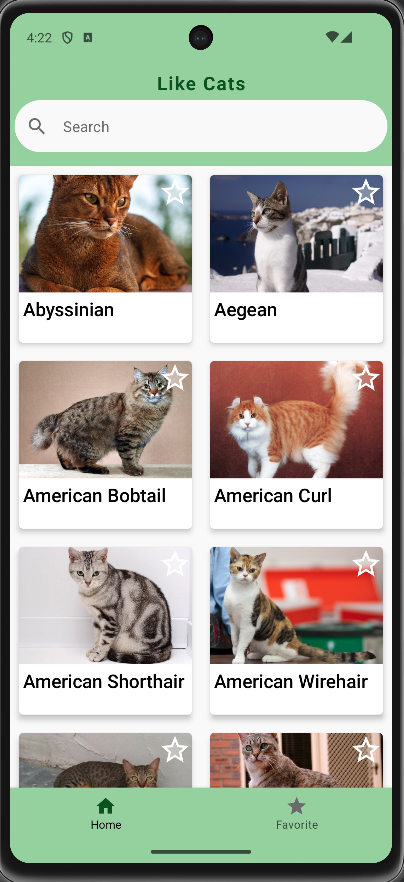
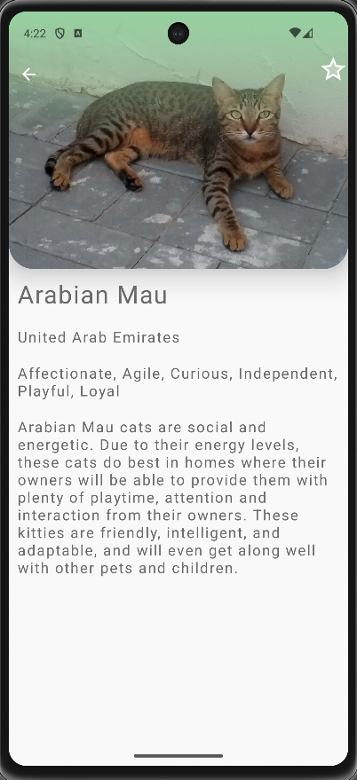
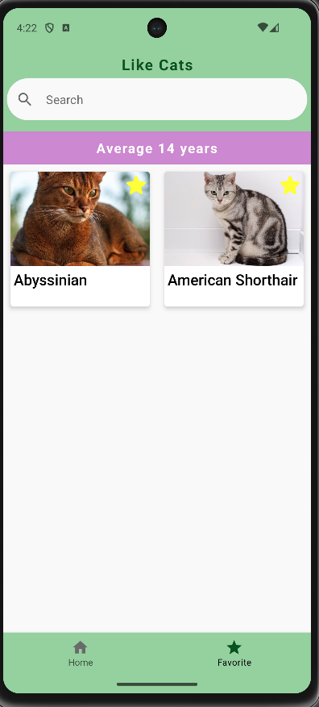

# Sword Health - Test

# <b>Like Cats:</b>

# <b>Overview</b>
A mobile application developed in Kotlin, utilizing the Cat API. It provides cat enthusiasts with
detailed information about various cat breeds, including images, breed details, and the ability to
mark favorites. The app is designed following modern Android development practices, ensuring a
seamless and enjoyable user experience.

# <b>Key Features</b>
<b>Cat Breeds Listing:</b> List of cat breeds with images and names.

<b>Search Functionality: </b>A search bar for filtering cat breeds by name.

<b>Favorite Marking: </b> Set/unset breeds as favorites.

<b>Favorites Screen:</b> List of favorite breeds with average lower lifespan.

<b>Detailed Breed View: </b>Detailed information about each breed, including origin, temperament,
description, and favorite option.

<b>Navigation: </b>Utilizes Jetpack Navigation Component for fluid screen transitions.

<b>Offline Support: </b>Incorporates Room for local data storage to enable offline functionality in
the favorite screen and caching request

<b>Light and Dark Mode: </b> The app support dark and light mode

# <b>Technical Details</b>
<b>Architecture:</b> Implements MVVM (Model-View-ViewModel) for efficient data handling and
separation of concerns.

<b>UI Framework:</b> Uses Jetpack Compose for a declarative and responsive UI.

<b>Testing:</b> Includes unit tests to ensure code reliability and correctness.

<b>Error Handling:</b>Robust error management for a smooth user experience.

<b>Pagination:</b>Implemented in the breeds list for efficient data loading.

<b>Modularity:</b> Codebase is organized in a modular fashion for maintainability.

# <b>Technical Decisions</b>
We have adopted a modular structure housed in the "Modules" folder, providing a clean and organized codebase. Below is a detailed breakdown of our structure and the key decisions behind it.

Module Structure

# Home Module:

Functionality: 
Manages the logic for displaying a list of cat breeds, including images and names.
Features: Supports pagination for efficient data handling.

# Favorite Module:

Functionality: 
Displays a list of favorite breeds, emphasizing those with a lower average lifespan.
Purpose: Enables users to quickly access their preferred breeds.

# Detail Module:

Functionality:
Provides detailed information about each breed.
Features: Includes breed origin, temperament, description, and the option to mark as a favorite.
Each module is further divided into specific subdirectories for optimal organization:

# Others:
data: Houses all the POJO classes used within the module.
domain: Contains classes related to use cases.
network: Manages classes that define API interactions and repositories.
ui: Focuses on reusable components and main screens.
viewmodel: Contains the ViewModel class that interacts with the use case.
Dependency Injection (DI) with Dagger
Our project utilizes DI with Dagger, organized by modules in the di folder:

Common: Includes all shared dependencies.
UI: Contains generic classes related to UI, such as navigation and themes.
Utils: Houses API configuration, a class for tracking data interaction states, and utility functions.

Shared Components
SharedViewModel: Responsible for managing the search variable, ensuring consistent and efficient search functionality across the app.
SharedDataRepository: Maintains references to selected elements, enhancing data flow and state management within the application.
